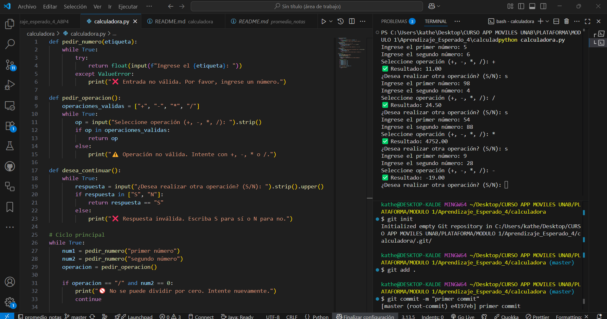

**_<h1 align="center">:vulcan_salute: Ejercicio con Python y PSeInt: Calculadora Interactiva :computer:</h1>_**

**<h2 align="center">&#128203; Código realizado con ChatGPT en lenguaje Python para cumplir con requerimiento.</h2>**

**<h3>Actividad 3: Detección y corrección de errores en pseudocódigo con apoyo de IA</h3>**

**1. :blue_book: Contexto:**
- En una situación real de trabajo, un compañero de equipo comparte contigo un pseudocódigo que no funciona correctamente.
- Tu rol es identificar los errores y solucionarlos utilizando tanto tus conocimientos como herramientas de IA.

**2. :green_book: Requerimientos:**
- Se entrega un pseudocódigo con errores (estructurales o lógicos) que simula una calculadora básica (suma, resta, multiplicación, división).
- Debes analizar el código por tu cuenta e identificar los posibles errores.
- Luego, debes escribir un prompt dirigido a ChatGPT solicitando ayuda específica para corregir el algoritmo.
- Finalmente, debes corregir el pseudocódigo, implementarlo en PSeInt y validarlo con diferentes entradas.

**3. :orange_book: Entregable:**
- Análisis personal de los errores detectados.
- Prompt enviado a ChatGPT y respuesta recibida.
- Versión corregida del pseudocódigo.
- Archivo PSeInt funcional con evidencias de ejecución.
- Reflexión sobre cómo la IA puede complementar tus habilidades en la depuración de código.
